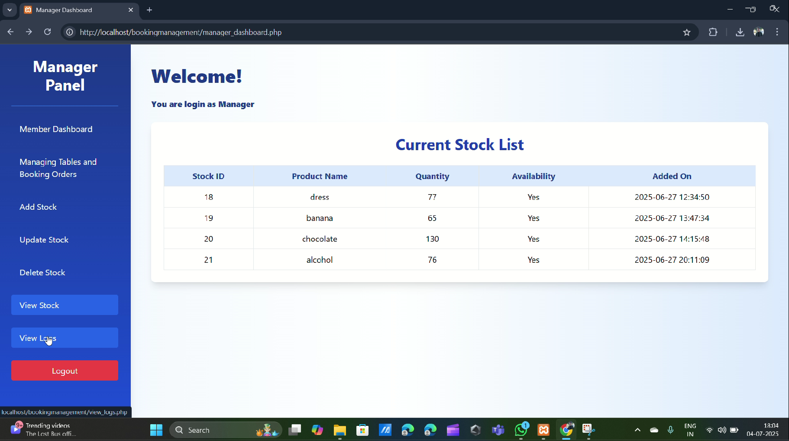
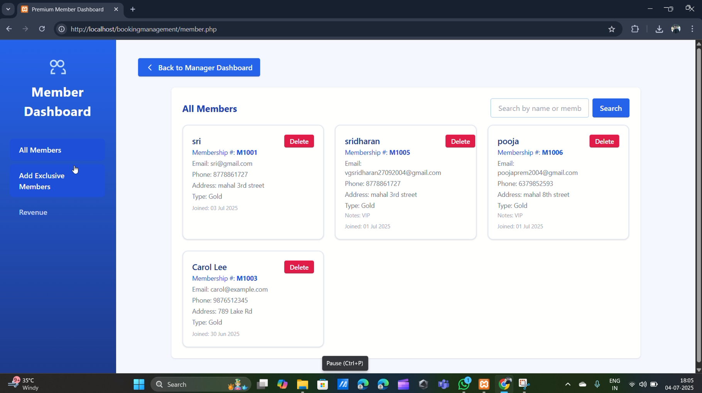
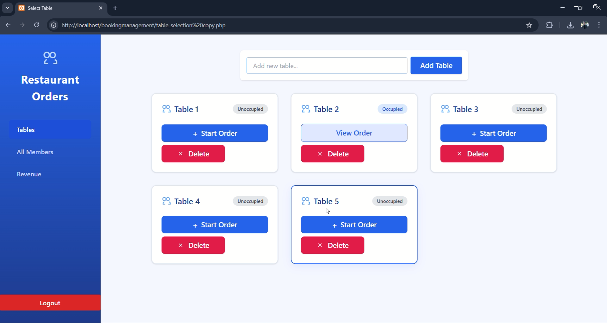
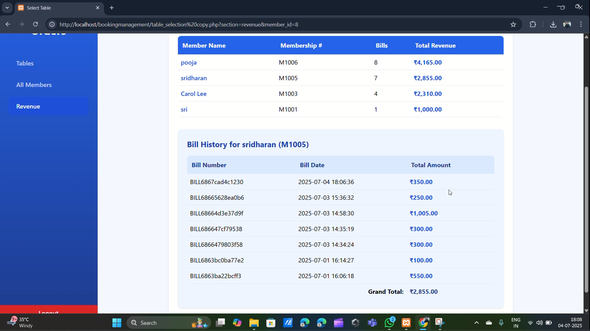

# 🍽️ Restaurant Booking Management System

A web-based restaurant booking and management system designed to streamline operations for both managers and cashiers. This system allows for efficient table management, stock control, customer membership handling, and revenue tracking.

---

## 🔧 Tech Stack

- **Frontend**: HTML, Tailwind CSS, JavaScript  
- **Backend**: PHP  
- **Database**: MySQL  

---

## 🔐 User Roles

### 👨‍💼 Manager

The manager has full access to all system functionalities:

- **Stock Management**
  - Add, update, and delete stock items
  - View complete stock activity logs
- **Table Management**
  - Add or remove tables as needed
  - Book tables for customers (Guest / Premium Members)
  - View and manage individual customer orders per table
- **Membership Management**
  - Add or remove members
  - Book tables and bill orders for members
- **Revenue Tracking**
  - View revenue generated by premium members

### 💼 Cashier

The cashier has limited but essential access:

- **Table Booking**
  - Book free tables for guests or premium members
  - Add or remove tables as required
  - Track individual customer orders linked to each table
  - Generate an bills

---

## 📸 Screenshots

| Feature                | Preview                         |
|------------------------|----------------------------------|
| 🧑‍💼 **Manager Dashboard** |  |
| 🧑‍💼 **Membership** |  |
| 🪑 **Table Booking**     |  |
| 💰 **Revenue Report**   |  |

---

## 🚀 Getting Started

1. Clone the repository:
   ```bash
   git clone https://github.com/Sri2704/Restaurant_Booking_Management.git
